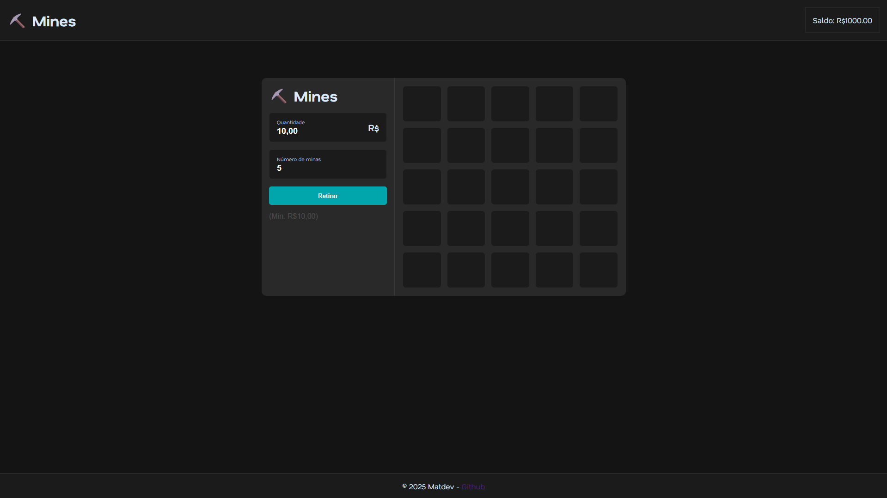

# ⛏️ Mines - Game



A fun and interactive **Mines Game** where luck, strategy, and risk meet! Click cards to reveal gems while avoiding hidden bombs. The more gems you uncover, the higher your potential reward — but hit a bomb, and you lose your bet.

**Live demo:** [Click here](https://matheusvkr.github.io/MinesGame/)

---

## Features

- 5x5 card grid with hidden bombs  
- Adjustable number of bombs (mines) for customizable difficulty  
- Real-time bet and balance management  
- Risk-based rewards calculated dynamically based on bet and number of mines  
- Cash Out feature to secure winnings before hitting a bomb  
- Overlay messages for **Win** or **Lose**  
- Responsive design, works on desktop and mobile  
- Lightweight and no external libraries required

---

## Built With

- HTML5  
- CSS3  
- Vanilla JavaScript (ES6)  

No frameworks — fully frontend game.

---

## How to Play

1. Enter your bet amount.  
2. Select the number of bombs on the board.  
3. Click **Start** to reveal the 5x5 grid.  
4. Click on cards to uncover gems:  
   - Each gem increases your profit based on risk.  
   - Clicking a bomb ends the game and you lose your bet.  
5. Click **Retire / Cash Out** after opening at least one gem to secure your winnings.  

---

## ⚡ Installation (Local)

1. Clone the repository:

```bash
git clone https://github.com/matheusvkr/MinesGame.git
cd MinesGame
